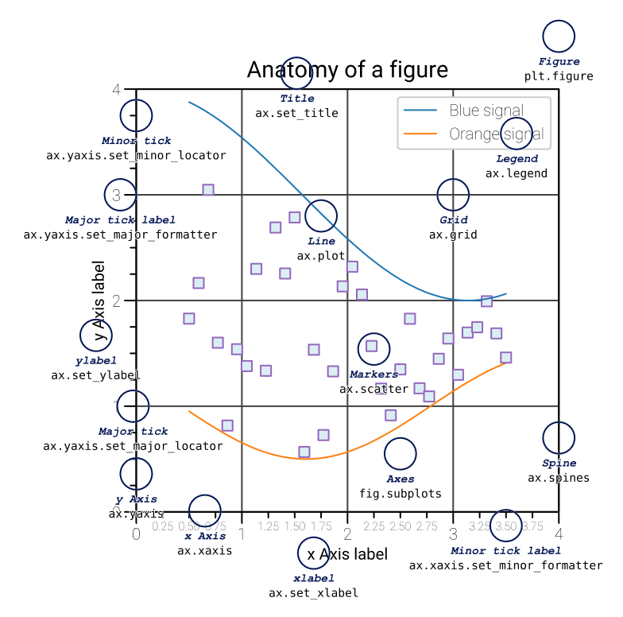
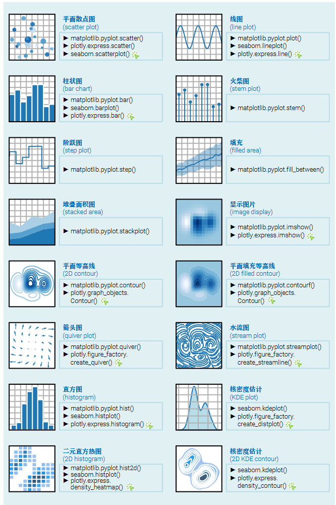
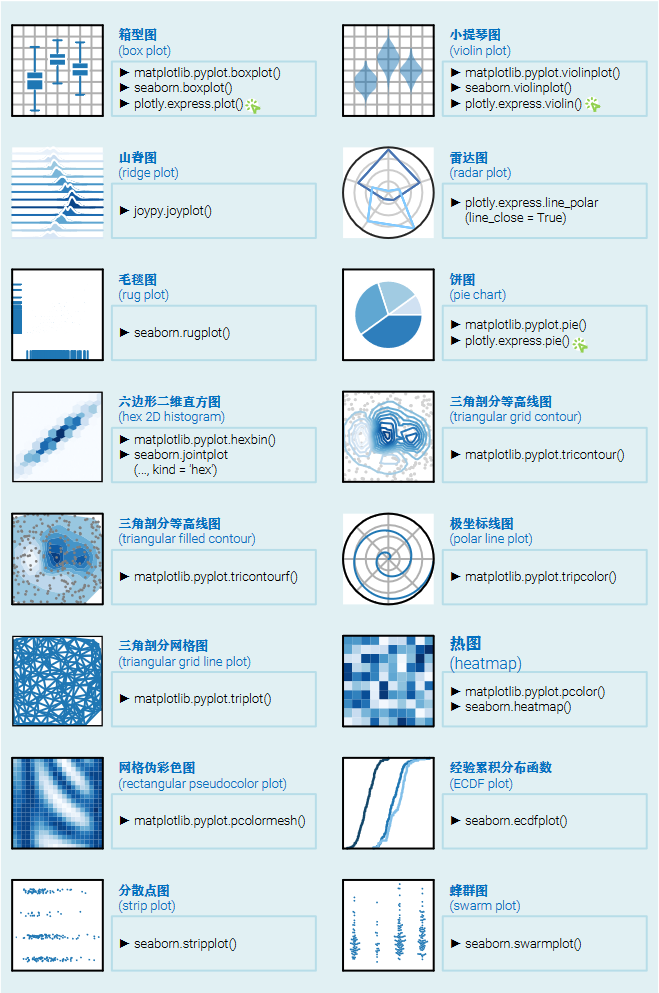
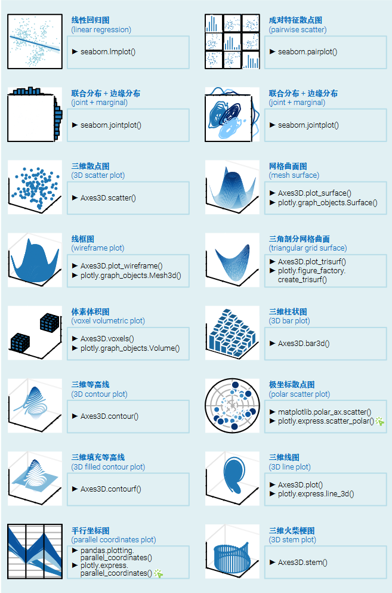

# Visualization

```txt
Art washes away from the soul the dust of everyday life.
--Pablo Picasso
```

在开始可视化之前，务必明确图片的目标是什么，以及确定图片的受众是谁

> ► 风格是学术专业？还是轻松活泼？
>
> ► 是否允许手绘？
>
> ► 图片大小尺寸？比例如何？
>
> ► 一幅图是否可以多子图？子图布局有何要求？
>
> ► 图片内文字字体 (Times New Roman, Arial, Roboto, ...)？
>
> ► 文字字号最大、最小几号？文字颜色是否有要求？
>
> ► 图片中的文字是否要求可编辑？
>
> ► 图片中是否可以嵌入公式？
>
> ► 黑白、彩色？配色有何特殊要求？
>
> ► 是否需要考虑彩色图片在黑白灰打印时呈现效果？
>
> ► 是否需要针对色盲群体调整配色？
>
> ► 颜色采用 RGB，还是 CMYK？
>
> ► 图中线宽、线型是否有要求？
>
> ► 是否有必要删除隐藏图层的元素
>
> ► 图片是静态，还是交互？
>
> ► 图片的格式？矢量图，还是像素图？
>
> ► 图片如果过大，是否可以光栅化 (rasterize)？
>
> ► 像素图的像素要求如何？最小、最大像素？
>
> ► 图片是否需要单独保存，并提交？
>
> ► 图片文件格式 (JPEG、PNG、GIF、SVG、TIFF、PDF ...)、大小是否有要求？
>
> ► 图片是否要用于演示，比如放在 PPT 中？PPT 中的文字大小如何？插图文字大小如何？
>
> ► 是否需要制作动画，比如 GIF？
>
> ► 是否考虑创作 App 应用、dashboard？



## 保存图像的格式

SVG (Scalable Vector Graphics)，扩展名为.svg，基于 XML 的矢量图格式，可以无损缩放和编辑。这也是鸢尾花书系列最常用的图片导出格式

PDF (Portable Document Format)，扩展名为.pdf，是通用的跨平台文档格式，支持矢量图和位图，并能保留图形的高质量，适用于打印、展示和共享。大家如果要用 LaTeX 写文章，可能会 用到这种图片格式

PNG (Portable Network Graphics)，扩展名为.png，是无损的位图格式，支持透明度和高质量压缩

JPEG (Joint Photographic Experts Group)，扩展名为.jpg 或.jpeg，是常见的有损压缩格式，特别适用于存储和传输照片和复杂图像。注意，JPG/JPEG 不支持图像的透明度，这一点 没有 PNG 方便

EPS (Encapsulated Postscript)，扩展名为.eps，是基于 PostScript 语言的矢量图格式，支持高质量的打印输出，常用于出版和印刷领域。Adobe Illustrator 可以很轻松地处理 EPS 格式图形

## 图表的类型




